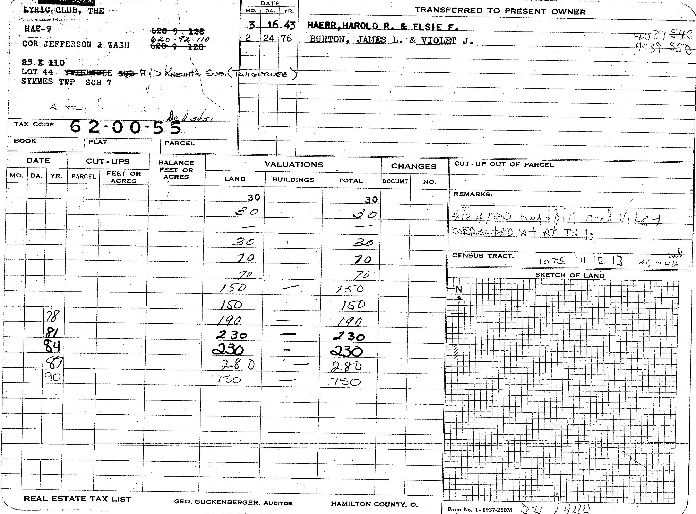
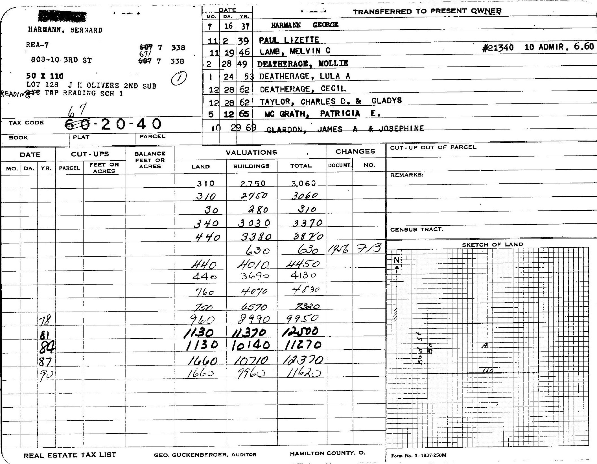
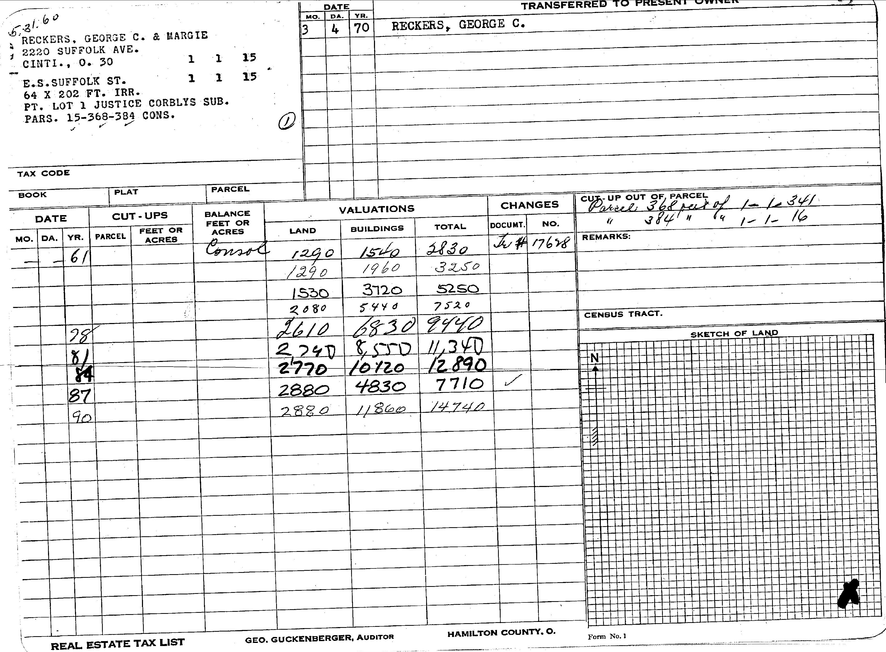

# Manual sample labeling

This document discusses how to use the scripts in this directory to manually label data.

## Requirements

The following packages/libraries must be installed

1. pytesseract
   1. macOS: `brew install tesseract`
2. PostreSQL
   1. macos: `brew install postgresql`
3. packages in `requirements.txt` of this directory

## Workflow

1. Populate `samples.labels` table with new unlabeled samples by running the `populate_samples.py` script. This script uses the SQL logic in `sql_templates/populate_samples.sql.j2` to determine what to include. This script is idempotent so it can be run multiple times without adding the same entries multiple times.
2. Download the data for labeling by running the `download_samples.py`. This script obtains a number of entries, which can be specified via command line arguments, that have not yet been downloaded yet and attempts to retrive the Ownership Card from the county website. There is some light image processing to crop and rotate the image. This script will place the downloaded images in `data/` along with a label csv file that needs to be filled out.
   1. The script will upload the samples to GDrive for labeling.
   2. Open the `.csv` file in Google Sheets to create the sheets file.
   3. The `building_labels.csv` file can then be deleted once the Google Sheets file is created.
3. Manual labeling by editing the label csv file.
   1. Updated instructions at https://docs.google.com/document/d/1bKtzUh36x76Rw_6mXfJIqxfIiV-P7mlG-fwAq7tAfJ0/edit?usp=sharing.
   2. Previous instructions:
      1. Sort the images in the Google Drive folder in ascending order to match the order in the csv file.
      2. If the image of the ownership card is not valid (e.g. empty or badly cropped), enter `error` in the label csv file under the `building_value` column.
      3. If no row under the `BUILDINGS` column with a valid value, but the ownership card is otherwise valid, no edits are necessary. For example:
      
      4. If there is a row under the `BUILDINGS` column with a valid value, enter the earliest such value in the `building_value` column of the label file corresponding to the same parcelid as the image of the ownership card. If the same row contains a non-empty year in the `DATE` column, enther the complete year (i.e. `1978` instead of `78`) in the `value_year` column of the label file, otherwise leave it blank. If the value is handwritten, enter `1` in the `handwritten` column, otherwise leave it blank.
      5. If there are any other scenarios that are not described here, enter `error` in the label csv file under the `building_value` column.
      6. For example, the entry in the label file should be:

```
parcelid,building_value,year,handwritten
6710007033800,2750,,
```

   for the image:
   
and
```
parcelid,handwritten,value_year,building_value
6710007033800,1540,61,1
```

   for the image:
   

4. Once the label csv file is filled out, it can be uploaded by running the `update_building_values_labels.py`.

## Design

There are 4 labels in the `samples` schema of the database:

- `labels`: this is the table containing the samples we are interested in. This table contains both labeled and unlabeled entries and need to be queried to retrieve the labeled samples.
- `download_time`: this indicates when samples were downloaded by the `download_samples.py` script. We keep this data to try prevent downloading the same entry multiple times.
- `label_time`: this indicates when a sample has been labeled. Note that labeled samples may still have an empty value in the `samples.labels` if there was no corresponding value on the Ownership Card.
- `error`: this contains a list of samples where we weren't able to label manually as well as a message indicating the error. Most of the time, these are due to missing Ownership Cards from the county website.

### Sample life cycle

Each sample will go through the following steps:

1. Entry is added to `samples.labels` by the `populate_samples.py` script.
2. The ownership data is downloaded by the `download_samples.py` and recorded in `samples.download_time`.
   1. If an error occurs, it will be recorded in `samples.error`.
3. Once the manual labeling is complete, the sample's labels will be updated in `samples.labels` by the `update_building_values_labels.py` script.
   1. If an error occurs, it will be recorded in `samples.error`.

## Open Questions

1. The current design has a hard assumption on `parcelid` being unique as it is used as a primary key in the SQL tables. This currently holds due to the logic in the SQL used to populate the `labels` table.
2. Currently scripts are written to be idempotent, which allows the scripts to be run multiple times without errors.
   1. `populate_samples.py` will no op if the sample already exists in the `labels` table
      1. Should there be a force option to force relabeling? This will also need additional updates in the other tables.
   2. `download_samples.py` will update `download_time` and `error` tables when sample already exist
   3. `update_building_values_labels.py` will update `label_time` and `error` tables when sample already exist
3. Error recovery:
   1. Currently, this hasn't been designed but we may need to consider this in the future. For example, we have fixed an issue that affected the downloading of Ownership Cards and want to relabeled these samples. In this case, we'll need to delete the entries in `download_time` and `error` so these samples can be downloaded again.
   2. Also consider realizing that a batch of manual labels need to be redone. In this case, we need to clear the manually labeled columns of the affected samples in `labels` and remove the corresponding entries in `label_time` and `download_time` (maybe even also `error`).
4. Additional features:
   1. Adding progress bars to display estimates of how long the script will run
   2. Optimized bulk table updates. Currently we update table entries one at a time through sqlalchemy which is very slow. Converting the updates to a table (via pandas df) and bulk updating will probably be much faster.